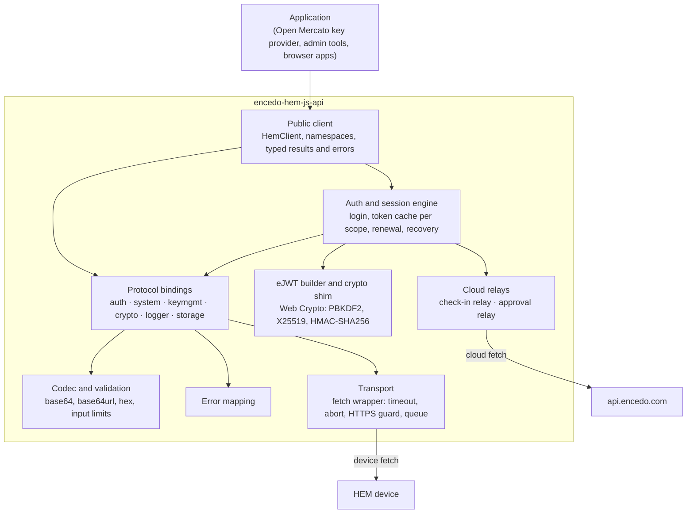
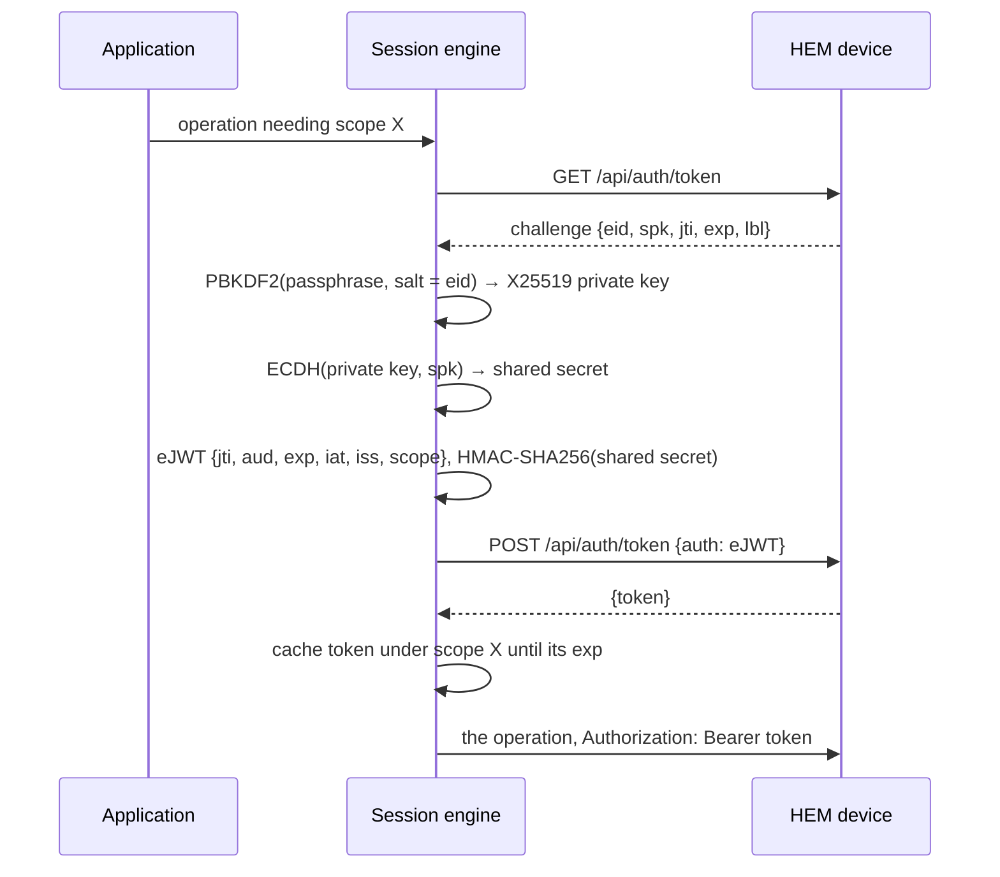

# encedo-hem-js-api — Architecture

This document defines **what** is being built and the decisions that shape
it. How the work is tracked — requirements, steps, traceability, change
management — is defined in
[REQUIREMENTS-MANAGEMENT.md](REQUIREMENTS-MANAGEMENT.md).

REQs and steps trace to the headings below via `ARCHITECTURE.md#<anchor>`;
rename a heading only through the §6.2 impact-analysis procedure.

Source tags used for device and API facts (REQUIREMENTS-MANAGEMENT.md §8):

| Tag | Source |
|---|---|
| **[C-SDK]** | https://github.com/KajtomatO/encedo-hem-c-api — device-verified C client, fw 1.2.2 |
| **[YAML]** | `ref/api/hem-api-1.2.2.yaml` |
| **[DOC]** | https://github.com/KajtomatO/encedo-hem-api-doc |
| **[BRIEF]** | `requirements/start_point/high-level-requirements.md` (items G1–G23, M1.1–M3.6, Q1–Q7) |

Nothing in this document has been verified by this library against a device
yet. Facts tagged [C-SDK] were verified by the C client; they are re-verified
here in the B part of each milestone (§8, §10).

## [TLDR]

**Purpose:** a TypeScript client library that lets a Node.js or browser
application use an Encedo HEM hardware security module through the device's
REST API (version 1.2.2, 58 operations). Its first consumer is an Open
Mercato integration that replaces HashiCorp Vault as the source of tenant
data-encryption keys [BRIEF §1].

**Core components:**

- **Public client** (`HemClient`) — one object per device, grouped into
  namespaces that mirror the API (`auth`, `system`, `keys`, `crypto`,
  `logger`, `storage`); promises in, typed results or typed errors out;
  binary values are `Uint8Array`.
- **Auth and session engine** — performs the device's login
  challenge/proof itself (PBKDF2 → X25519 → HMAC-signed eJWT), keeps one
  bearer token per scope, renews before expiry, re-authenticates after a
  401, and repairs the device clock through check-in when that is what
  blocks login. A paired mobile app can approve access instead of a
  passphrase.
- **Protocol bindings** — one module per API group; build the request,
  validate inputs against the documented hard limits, parse the response
  tolerantly, and normalise the known firmware quirks.
- **Transport** — a thin wrapper around a caller-replaceable `fetch`:
  timeout, cancellation, HTTPS guard, request serialisation.
- **Cloud relays** — small replaceable components that carry opaque
  strings between the device and the Encedo cloud (`api.encedo.com`):
  one for check-in, one for mobile approval.

**Technology choices:** TypeScript, published as ESM JavaScript with type
declarations; no runtime dependencies; only `fetch` and Web Crypto as
platform APIs; Node.js ≥ 24 and browsers with Web Crypto X25519; npm,
`tsc`, Vitest.

**Data flow:** the application calls a typed operation (for example
`client.crypto.wrap`) → the session engine supplies a valid bearer token
for the exact scope that operation needs (from the cache, or by logging in)
→ the binding validates and serialises the request → the transport sends it
through `fetch` → the response is parsed into a typed result, or the HTTP
status is mapped to a typed error.

**Key architectural decisions:**

- **Built only on `fetch` and Web Crypto** — the same package runs in Node
  and in browsers, with nothing to install or compile.
- **The caller owns the network edge** — TLS trust, proxies and test
  doubles are all handled by passing a `fetch`; the library has no TLS
  settings of its own.
- **One token per scope, chosen automatically** — callers never build or
  pick tokens.
- **PBKDF2 is the only login KDF.**
- **Cloud round trips are pluggable** — default relays ship, and either can
  be replaced or removed.
- **Every milestone has an A part and a B part** — A is implementation
  plus unit tests with no device; B is verification on hardware with the
  user present. They run in strict sequence.

## 1. Decisions (fixed)

Decisions already made and not up for re-litigation. REQs cite these.

| # | Decision | Origin |
|---|---|---|
| D1 | Written in TypeScript; published as ESM JavaScript with type declarations. | [BRIEF] G1 |
| D2 | No runtime dependencies, no native addons, no PKCS#11. | [BRIEF] G2 |
| D3 | Only `fetch` and Web Crypto are used as platform APIs; `src/` imports nothing from `node:`. | [BRIEF] G3 |
| D4 | Minimum Node.js version is 24. Browsers are supported wherever Web Crypto provides X25519. | user decision 2026-10-02 |
| D5 | Toolchain: npm, `tsc` for the build, Vitest for unit tests (run in Node and in a headless browser). All of it is development-only. | user decision 2026-10-02 |
| D6 | The login KDF is PBKDF2-HMAC-SHA256 only (600 000 iterations, 32-byte output, salt = the challenge `eid` as its raw string). Argon2 is not supported: the description of an Argon2 derivation attributed to Encedo Manager in [DOC] and in older [C-SDK] text is incorrect and is ignored. There is no KDF hook and no raw-secret credential. This exclusion is re-reviewed before M1B starts (§11, risk 14). | user decision 2026-10-02; parameters from [C-SDK] |
| D7 | Default relays for the Encedo cloud (check-in backend and mobile-approval broker at `api.encedo.com`) ship with the library behind small interfaces, so a caller can replace or disable them. | user decision 2026-10-02 |
| D8 | Each milestone is split into an **A** part (implementation and unit tests, no device) and a **B** part (tests and verification on hardware, with user interaction). Order is strict: M1A → M1B → M2A → M2B → M3A → M3B. | user decision 2026-10-02 |
| D9 | Requirements for all three milestones are drafted at bootstrap; each stays `draft` until a human approves it. All 117 were approved on 2026-10-02. | user decision 2026-10-02 |
| D10 | The hardware used in the B parts, and the policy for what tests may do to it, are defined just before M1B starts — not earlier. | user decision 2026-10-02 |
| D11 | The library targets API version 1.2.2 as described by [YAML]. Out of scope: PKCS#11 and native code; endpoints that exist only in diagnostic firmware; endpoints not in the 1.2.2 reference; the Open Mercato integration itself; the device's static web dashboard. | [BRIEF] §1 |
| D12 | Credentials and tokens are held in memory only; the library never logs or persists them and reads no configuration files or environment variables. | [BRIEF] G13 |
| D13 | Each milestone ends in a usable, versioned release; later milestones add to the public API without breaking earlier ones. | [BRIEF] G4 |
| D14 | Disruptive operations (reboot, shutdown, wipe, firmware or dashboard upgrade, provisioning) are never exercised automatically. | CLAUDE.md |
| D15 | MIT license. | `LICENSE` |

## 2. Context & constraints

The **Encedo HEM** is a hardware security module that presents itself as a
USB network adapter and serves a REST API over HTTP (port 80) and HTTPS
(port 443, TLS 1.3). The reference lists `https://my.ence.do` and
`https://192.168.7.1` as addresses [YAML]. The API has 58 operations in six
groups: `auth` (9), `system` (18), `keymgmt` (10), `crypto` (13), `logger`
(4), `storage` (4) [YAML].

Facts about the device that shape the design:

- **Tokens.** Calls are authorised by a bearer JWT signed with a per-boot
  session key; every token becomes invalid when the device reboots. A token
  carries one scope. Most endpoints compare the scope by prefix; the crypto
  endpoints require the exact scope `keymgmt:use:<kid>` [YAML]. A token with
  a broader scope is rejected with 403 by a crypto operation [C-SDK].
- **Roles.** The token's `sub` claim is `U` (user), `M` (master, denied on
  all key-management and crypto operations), or a base64 key id for a paired
  mobile app [YAML].
- **A bad token breaks public endpoints.** A missing `Authorization` header
  is passed to the endpoint, but a present, invalid token is rejected with
  401 before routing [YAML].
- **Errors have empty bodies** unless documented otherwise [YAML].
- **Hard limits.** JSON bodies up to 7300 bytes (413 above, connection
  closed); key ids are 16 bytes as 32 hex characters; labels 1–32 printable
  ASCII characters; descriptions up to 64 bytes; messages nominally up to
  2048 bytes; list pages of at most 15 keys [YAML].
- **Clock.** Login fails with 403 while the device clock is not set, and
  the only way to set it is check-in [YAML]. The clock is unset after a cold
  boot or a wipe, and it runs about 8% fast, which eventually makes the
  device reject a correct login with 401 [C-SDK]. Unattended operation
  therefore depends on being able to run check-in, which needs the Encedo
  cloud.
- **Connections and load.** The device closes the TCP connection after
  every response; it can stall under sustained load and then needs a power
  cycle; behaviour under parallel requests is untested [C-SDK].
- **Hardware variants.** Some operations exist only on hardware with mass
  storage ("MSC build only"): audit-log listing and download, storage
  control, attestation, firmware and dashboard upgrade [YAML].
- **Login is deliberately slow.** Login responses are delayed to at least
  500 ms, and to 1500 ms after three consecutive failures [YAML].

Consumer constraints:

- The first consumer is a headless server process (Open Mercato on Node
  24) that must authenticate without a human, find or create its root
  keys, derive or wrap/unwrap data keys, and report device health
  [BRIEF §3].
- Scale is small: tens of keys, one device per client. The design favours
  few round trips (token caching) and gentle load over throughput.

## 3. Component overview



| Component | Responsibility | Must not do |
|---|---|---|
| Public client | stable TypeScript surface; options; namespaces; exported types and errors | expose internal modules; keep global state |
| Auth and session engine | login proof, token cache per scope, renewal, 401 and clock recovery, mobile approval, credential lifecycle | persist or log secrets; pick a scope the binding did not declare |
| eJWT builder and crypto shim | byte-exact eJWT encoding; thin wrappers over Web Crypto | implement cryptographic primitives itself |
| Protocol bindings | endpoint ↔ typed call mapping, declared scope per operation, quirk normalisation | call `fetch` directly; hold tokens |
| Codec and validation | byte ↔ base64/base64url/hex conversion; enforce documented input limits before sending | silently truncate or alter caller data |
| Error mapping | HTTP status and transport failure → typed error | require a response body |
| Transport | one request in, one response out; timeout, cancellation, HTTPS guard, serialisation, pacing | know about JSON shapes, scopes or tokens; follow redirects |
| Cloud relays | carry opaque strings between the device and `api.encedo.com` | interpret or alter what they carry; reuse the device `fetch` |

## 4. Public API & conventions

Names in this section are illustrative; the exact identifiers are fixed
during M1A and then frozen by the additive-API rule (D13).

- **Client.** `new HemClient(options)` — one client per device. Options:
  `url` (required), `fetch`, `timeoutMs`, `tokenLifetimeSeconds`,
  credentials, relays, pacing. Construction performs no I/O. There is no
  module-level state; any number of clients may coexist.
- **Namespaces** mirror the API groups: `client.auth`, `client.system`,
  `client.keys`, `client.crypto`, `client.logger`, `client.storage`.
- **Calls** are asynchronous and return promises. Every call accepts
  `{ signal, timeoutMs }`.
- **Binary values** are accepted and returned as `Uint8Array`. Base64,
  base64url and hex conversion is internal. Key ids are lowercase 32-hex
  strings; labels are strings; descriptions are bytes.
- **Errors.** Every failure is an instance of `HemError` with a stable
  `code`, and where applicable the HTTP `status` and the operation name.
  Subclasses:

  | Class | Raised for |
  |---|---|
  | `HemBadRequestError` | 400 |
  | `HemUnauthenticatedError` | 401 that survives one re-authentication |
  | `HemForbiddenError` | 403 |
  | `HemOperationFailedError` | 406 |
  | `HemDeviceStateError` | 409 |
  | `HemOriginRejectedError` | 412 |
  | `HemPayloadTooLargeError` | 413 |
  | `HemTlsRequiredError` | 418, or a key-management/crypto call attempted over plain HTTP |
  | `HemDeviceError` | 500 and any other unexpected status |
  | `HemTimeoutError` | the call's time limit elapsed |
  | `HemUnreachableError` | `fetch` rejected (connection, DNS, TLS) |
  | `HemAbortError` | the caller's `AbortSignal` fired |
  | `HemValidationError` | input violates a documented limit; nothing was sent |
  | `HemProtocolError` | a success response is missing a required field or is not parseable |
  | `HemUnsupportedError` | the operation does not exist on this hardware, or the runtime lacks a required capability |
  | `HemApprovalRejectedError`, `HemApprovalTimeoutError` | mobile approval was denied, or not answered in time |

- **Verify operations** return `true` or `false`; an invalid signature or
  MAC is a result, not an error [BRIEF M2.2].
- **Paged operations** hide the device's path variants behind one call
  with `offset` and `count` [BRIEF M1.4, M2.4].
- **Dangerous operations** (wipe, provisioning, attestation-certificate
  write, firmware install, shutdown) are separate, explicitly named calls;
  no option on another call can trigger them [BRIEF M3.2].
- **Documentation.** Every public operation carries TSDoc stating the
  token scope it needs and the milestone that introduced it [BRIEF G23];
  operations that exist only on mass-storage hardware say so [BRIEF G20].
- **Versioning.** Semantic versioning. Releases are cut at B gates: 0.1.0
  after M1B, 0.2.0 after M2B, 1.0.0 after M3B. The public surface only
  grows between them.

## 5. Auth & session

### 5.1 Passphrase login



All of the following is [C-SDK], live-proven there against firmware 1.2.2:

- **Key derivation.** PBKDF2-HMAC-SHA256, 600 000 iterations, 32-byte
  output. Password = the passphrase as UTF-8. Salt = the challenge `eid`
  exactly as received (the base64 text, not its decoded bytes). The output
  is the X25519 private key. The device stores only the matching public
  key, registered when it was initialised, so the derivation cannot vary.
- **Key agreement.** Shared secret = X25519(private key, `spk`), where
  `spk` is standard base64 of 32 bytes. The raw 32-byte secret is the HMAC
  key.
- **eJWT.** Three base64url segments without padding, joined by dots:
  the fixed header `{"ecdh":"x25519","alg":"HS256","typ":"JWT"}`; the
  claims, serialised compactly in the order `jti` (from the challenge),
  `aud` (the `spk` string), `exp`, `iat`, `iss` (the user's public key in
  standard base64 with padding), `scope`; and the HMAC-SHA256 tag over the
  first two segments.
- **Lifetime.** The `exp` claim is the requested expiry of the bearer
  token; the device copies it into the token. The challenge's own `exp`
  (device time plus 60 s) is only the deadline for submitting the proof.
- **Test vector.** A byte-exact login vector is recorded in REQ-AUTH-002.

### 5.2 Session behaviour

- **Token cache.** One token per exact scope string, in memory. Each
  binding declares the scope it needs; the engine selects or obtains the
  token. Crypto calls use `keymgmt:use:<kid>` — one token per key
  [BRIEF G10]. `GET /api/keymgmt/get/{kid}` uses the same per-key scope, so
  reading a key and using it share a token [C-SDK].
- **Lifetime and renewal.** The default requested lifetime is 8 hours and
  is configurable [BRIEF G11]. A token is treated as expired 60 seconds
  before its `exp` claim and is then re-obtained before the next call.
  The largest lifetime the device accepts is not known (§11).
- **After a 401.** The cached token for that scope is dropped, a new one
  is obtained, and the call is retried once. A second 401 is an error.
  This is what makes the client survive a device reboot [BRIEF G11].
- **Clock recovery.** If the challenge request returns 403 (clock not
  set), or the proof returns 401 while the challenge shows the device clock
  has drifted from the local clock by more than 60 seconds, the engine runs
  one check-in (§6) and repeats the login once. A 401 without drift
  evidence is a wrong passphrase and never triggers a check-in. At most
  one recovery check-in happens per token acquisition. Recovery can be
  switched off, and is unavailable if no check-in relay is configured.
- **Concurrency.** Concurrent calls that need the same scope share one
  acquisition.
- **Public endpoints get no token.** The engine never attaches a bearer
  token to an operation that does not need one, because a stale token
  would turn a public endpoint into a 401 [YAML].
- **Roles.** A client holds one credential. Whether it acts as user or
  master is decided by the device, by which registered key the derived key
  matches; the client exposes the role from the token's `sub` claim
  [BRIEF G12]. Master login has not been verified by any §8 source (§11).
- **Credential lifecycle.** The derived private key is kept in memory
  (as a non-extractable `CryptoKey` where the runtime allows), bound to the
  `eid` it was derived for; the passphrase is not retained after
  derivation. `logout()` discards the credential and every cached token.
  Nothing is written to disk, storage or logs [BRIEF G13].

### 5.3 Mobile approval

A paired mobile app can approve a scope instead of a passphrase
[BRIEF §3]. The device-facing part is two unauthenticated calls
[BRIEF M1.2]:

1. `POST /api/auth/ext/request {epk, scope, ctx?, note?}` → `{authreq, epk}`
2. `POST /api/auth/ext/token {authreply}` → `{token}`

Between them the request has to reach the phone and the reply has to come
back. The device never talks to the cloud; the client relays [C-SDK]. That
is the job of an **approval relay**:

| Relay step | Default relay (`https://api.encedo.com/notify`) [C-SDK] |
|---|---|
| obtain a broker key to use as `epk` | `GET /session` → `{epk, exp}` |
| submit the request | `POST /event/new {authreq, epk}` → `{eventid, …}` |
| check for an answer | `GET /event/check/<eventid>` → 202 pending · `{"deny":true}` rejected · `{authreply, …}` approved · 404 unknown or expired |

On top of the two device calls and the relay, an **approval engine**
offers begin / poll / wait, with three distinct outcomes: approved (token
cached under the requested scope), rejected, timed out. Defaults: poll
every 5 seconds, wait up to 60 seconds [C-SDK]. A client configured for
mobile login uses this engine wherever the passphrase path would log in.

Recorded behaviour that callers must know [C-SDK]:

- The client does no cryptography in this flow; everything it carries is
  opaque.
- The broker API is undocumented and was reconstructed; it can change
  without notice (§11).
- The broker rejects a request whose `iat` is ahead of its own clock, so
  device clock drift breaks mobile approval within minutes; the remedy is
  one check-in and a fresh request.
- Tokens approved by the real Encedo app live 15 minutes. A
  `keymgmt:use:<kid>` scope means one push notification per key.
- If no phone is paired, the request still succeeds and the wait simply
  times out.
- The broker learns the caller's IP address and forwards its geolocation
  to the phone.

Pairing a phone (`ext/init`, `ext/validate`, `ext/mac`, and the broker's
registration calls) belongs to M3.

## 6. Protocol bindings

One module per API group. Each binding: validate inputs → build the URL
and JSON body → ask the session engine for a token of its declared scope
(or none) → send through the transport → parse the response → map errors.

| Group | Operations (count in [YAML]) | Token scope used | Milestone |
|---|---|---|---|
| auth | login challenge and proof (2) | none | M1 |
| auth | mobile approval request and redeem (2) | none | M1 |
| auth | provisioning challenge and provision (2) | none | M3 |
| auth | mobile-app pairing: init, validate, mac (3) | `auth:ext:pair` | M3 |
| system | status, version, check-in get and post (4) | none | M1 |
| system | config read (1) | `system:config` | M2 |
| system | config write, attestation, provisioning certificate, selftest, reboot, shutdown, usbmode, firmware and dashboard upload/check/install (13) | `system:config`, `system:upgrade`, `system:shutdown`, or none on a factory-fresh device | M3 |
| keymgmt | create, get, search, list ×3 (6) | `keymgmt:gen`, `keymgmt:use:<kid>`, `keymgmt:search`, `keymgmt:list` | M1 |
| keymgmt | update, delete, import, derive (4) | `keymgmt:upd`, `keymgmt:del`, `keymgmt:imp`, `keymgmt:gen` | M2 |
| crypto | HMAC hash, wrap, unwrap (3) | `keymgmt:use:<kid>` | M1 |
| crypto | HMAC verify, ExDSA sign/verify, encrypt, decrypt, ECDH, ML-KEM encaps/decaps, ML-DSA sign/verify (10) | `keymgmt:use:<kid>` | M2 |
| logger | key, list ×2, download (4) | `logger:get` | M2 |
| storage | lock, unlock ×3 (4) | `storage:disk<N>` or `storage:disk<N>:rw` | M3 |

Conventions:

- **Tolerant parsing.** Unknown response fields are ignored; a missing
  required field is a `HemProtocolError`.
- **Input limits** from [YAML] are enforced before sending [BRIEF G17].
- **Health.** `client.system.health()` combines what a circuit breaker
  needs — reachable, initialised, no latched self-test fault, clock set —
  into one result that does not throw for an unreachable device
  [BRIEF M1.5].
- **Check-in** is exposed as its two device steps
  (`GET` and `POST /api/system/checkin`) plus a one-call convenience that
  runs them around a **check-in relay** [BRIEF M1.3]. The default relay
  posts the device's `check` reply to `https://api.encedo.com/checkin` and
  returns the backend's `checked` reply [C-SDK]. When the device's
  trusted-backend option is on, the backend's reply can carry management
  actions: lock, wipe, soft-brick, forced upgrade [YAML].
- **Mass-storage-only operations** are marked in the documentation and
  fail with `HemUnsupportedError` on other hardware [BRIEF G20].
- **Operations that restart the device** (install, reboot, shutdown,
  wipe, usbmode) treat a dropped connection after the request was sent as
  success, and clear the token cache [BRIEF M3.3].

Firmware quirks the bindings normalise or document [BRIEF G16]:

| # | Quirk | Source | Handling |
|---|---|---|---|
| 1 | Over plain HTTP, `DELETE /api/keymgmt/delete/{kid}` and `POST /api/crypto/hmac/hash` answer 409 instead of 418. | [YAML] | The HTTPS guard refuses these calls before sending, so callers always see `HemTlsRequiredError`. |
| 2 | ML-KEM decapsulation returns an unrelated string in `alg`. | [YAML], [C-SDK] | The field is not exposed. |
| 3 | A failed ML-DSA verification puts a raw internal code in the HTTP status line (100 per the reference; 795 observed). | [YAML], [C-SDK] | Any completed response that is neither success nor an authentication error means "invalid". How `fetch` surfaces such a status is unverified (§11). |
| 4 | `POST /api/keymgmt/derive` with an unrecognised `type` returns 200 and echoes the source key id without creating a key. | [YAML] | The type is checked against the known list before sending, and a returned id equal to the source id is an error. |
| 5 | `POST /api/keymgmt/update` rewrites the whole record: omitting `descr` clears it. `label` is always required. | [C-SDK], [YAML] | The call takes both fields explicitly. |
| 6 | The device accepts a 65-byte description on create and silently truncates it on read. | [C-SDK] | Descriptions over 64 bytes are rejected before sending. |
| 7 | `GET /api/keymgmt/get/{kid}` never returns the label, and on fw 1.2.2 not the description either. | [C-SDK] | Documented; label and description come from list or search. |
| 8 | Search matches against the base64 text of the stored description; no match is 200 with an empty list (older firmware: 404). | [C-SDK] | 404 is mapped to an empty result. |
| 9 | Raw ECDH output is truncated to 32 bytes even for larger curves. | [C-SDK] | Documented. |
| 10 | In HMAC with a stored key, `alg` is ignored; the key's type decides the hash. | [YAML], [C-SDK] | `alg` is not sent in stored-key mode. |
| 11 | SECP keys are created ECDH-only unless `mode` asks for ExDSA; signing with them fails with 406. | [C-SDK] | Documented on create and sign. |
| 12 | Importing or deriving the same key material again fails with 406, because key ids are derived from the material. | [YAML], [C-SDK] | Documented. |
| 13 | Firmware upload can close the connection with no response for an oversize image or a wrong file extension. | [YAML] | Size and filename are validated before sending. |
| 14 | `GET /api/system/status` omits fields rather than sending defaults (`inited` only when false, `ts`/`time` only when the clock is set, `https` only over plain HTTP). | [YAML] | Parsed into explicit booleans. |
| 15 | Audit-log files are pipe-delimited text. | [C-SDK] | Returned verbatim; never parsed [BRIEF M2.3]. |
| 16 | Firmware 1.2.2 acknowledges a certificate delivered by check-in but never installs it. | [C-SDK] | Documented; the working path is TLS import through config write (M3). |
| 17 | The device clock runs about 8% fast and is unset after a cold boot. | [C-SDK] | Clock recovery (§5.2). |

## 7. Transport

- **`fetch` injection.** The client uses `globalThis.fetch` unless the
  caller passes its own. TLS trust for the device certificate, proxies,
  connection settings and test doubles are all the caller's `fetch`
  [BRIEF G6].
- **Address.** The device URL is required and may be a hostname or an IP
  address, `https:` or `http:` [BRIEF G5]. The library has no default
  address.
- **HTTPS guard.** Key-management and crypto operations are refused
  before sending when the URL is not `https:` [BRIEF G8]. Other operations
  work over plain HTTP, which a device without TLS material needs.
- **Timeout and cancellation.** Every call has a time limit (default 30
  seconds; the C client uses the same and it covers the login delay
  [C-SDK]) and accepts an `AbortSignal` [BRIEF G7]. Key generation for
  post-quantum types can take much longer, so callers can raise the limit
  per call.
- **Failure classes.** Time limit elapsed, caller abort, and `fetch`
  rejection are distinguished (§4).
- **Serialisation and pacing.** A client sends one device request at a
  time; further calls wait in order. An optional minimum interval between
  requests can be set (default none). This follows from the load behaviour
  in §2; the real concurrency limit is unknown (§11).
- **Headers.** Requests carry only `Content-Type`, `Authorization` and,
  for uploads, `Content-Disposition` — all inside the set the device's
  CORS preflight allows [YAML]. No other custom header is sent.
- **Redirects** are not followed.
- **Cloud relays use their own `fetch`** (default `globalThis.fetch`), so
  a device `fetch` with relaxed TLS is never used against `api.encedo.com`.
- **TLS trust.** The dev device presents a public-CA certificate for
  `my.ence.do`, so default trust works while that certificate is valid and
  the device is addressed by that name [C-SDK]. For an IP address, an
  expired certificate or a private one, the caller supplies a `fetch` with
  the trust it wants. The C client's automatic recovery from an expired
  certificate cannot be reproduced through `fetch` and is out of scope.
- **Browsers.** A browser adds an `Origin` header, and the device answers
  412 unless that origin is on its allow-list — the `origin` setting,
  given at provisioning and changeable through config write [YAML].
  Putting the calling origin on that list is the caller's job; the library
  documents this and reports 412 as `HemOriginRejectedError`.

## 8. Testing policy

Two parts per milestone (D8):

- **A part — unit tests, no device.** Vitest with a substituted `fetch`
  [BRIEF G21]; no network access. The suite runs in Node 24 and in a
  headless browser, which is how the "runs in both" promise is checked.
  Covered: codec round trips, the eJWT vector, PBKDF2/X25519/HMAC against
  published vectors, token-cache timing with an injected clock, error
  mapping, input validation, every binding's request and response shape,
  relay behaviour against canned responses.
- **B part — hardware, with the user.** Three kinds of test:
  - **Integration**: against a real device, opt-in through environment
    variables read by the test harness (never by the library), skipped
    when they are absent [BRIEF G22].
  - **Attended**: needs a person — approving or rejecting on the phone,
    power-cycling the device.
  - **Disruptive**: reboot, shutdown, wipe, firmware or dashboard
    upgrade, provisioning. Never run automatically (D14); each needs an
    explicit opt-in and the user present.

  Which device is used and what tests may do to it is decided just before
  M1B (D10); until then no integration test is written.

Gates:

- **A gate**: build, type-check and unit suite pass in Node 24 and in a
  headless browser with no device; every REQ assigned to the part has
  `implements:` and `verifies:` tags.
- **B gate**: the integration suite passes against the device; the
  attended checks for the milestone were performed with the user; every
  device criterion of the milestone is resolved. A release is cut only
  after its B gate.

Device criteria: an acceptance criterion that can only be settled on
hardware is written with the prefix of the B part that settles it, for
example `- [ ] (M1B) …`. It stays unchecked through the A part. At the B
gate it is checked with the finding, or carried forward by an explicit
human decision.

## 9. Directory layout

```
src/                     code root (implements: tags)
  index.ts               public exports
  client.ts              HemClient and options
  errors.ts              error classes and status mapping
  codec/                 base64, base64url, hex, UTF-8; input validation
  crypto/                Web Crypto wrappers: PBKDF2, X25519, HMAC-SHA256
  auth/                  eJWT, session engine and token cache, approval engine
  api/                   auth.ts system.ts keymgmt.ts crypto.ts logger.ts storage.ts
  relay/                 check-in relay, approval relay (interfaces and defaults)
  transport/             fetch wrapper: timeout, abort, HTTPS guard, queue
tests/                   test root (verifies: and supports: tags)
  unit/                  A parts — substituted fetch, no network
  integration/           B parts — real device, opt-in
  attended/              B parts — user interaction and disruptive; never automatic
  support/               fake fetch, fixtures, test vectors
ref/api/                 OpenAPI reference (input, not code)
requirements/  workplan/ process (REQUIREMENTS-MANAGEMENT.md)
package.json  tsconfig.json  vitest.config.ts  .github/workflows/ci.yml
```

Code root `src/` and test root `tests/` match REQUIREMENTS-MANAGEMENT.md
§4.2. Build and CI requirements are realised in `package.json`,
`tsconfig.json` and `.github/workflows/`.

## 10. Milestones

Milestone IDs are used in step file names (`STEP-M1A-010-…`). Parts run in
strict sequence (D8). Scope comes from [BRIEF] §3–§5.

- **M1A — MVP: implementation and unit tests.** Package skeleton and CI;
  transport; errors; codec and validation; crypto shim; passphrase login
  with the eJWT vector; token cache, renewal, 401 and clock recovery;
  check-in with its default relay; mobile approval (two device calls,
  relay, engine, mobile login mode); status, version, health; key create,
  get, search, list; HMAC, wrap, unwrap.
  REQs: REQ-API-001…010, REQ-NET-001…012, REQ-AUTH-001…020,
  REQ-SYS-001…007, REQ-KEY-001…005, REQ-OPS-001…003, REQ-TEST-001…002,
  REQ-BUILD-001…005.
  **Gate:** A gate (§8); the login vector reproduces byte for byte.
- **M1B — MVP: hardware verification.** Starts with two reviews: defining
  the device and its test policy (D10) and drafting the requirement for it;
  and re-reviewing the exclusion of Argon2 (D6; §11, risk 14). Then the
  integration harness and live runs of everything in [BRIEF] §3 "Complete
  when": unattended passphrase login; create a root key and find it by
  description; HMAC; wrap and unwrap; health; check-in. Attended: approve,
  reject and time out a mobile approval on the real phone; keep working
  across a device reboot and a token expiry.
  REQs: REQ-TEST-003…004, REQ-BUILD-006, and the `(M1B)` criteria of the
  M1A REQs.
  **Gate:** B gate (§8); findings for Q1–Q6 recorded in §11; version 0.1.0.
- **M2A — daily usage and audit logs: implementation and unit tests.**
  Key update, delete, import, derive; every remaining crypto operation
  with all key modes; config read; audit-log key, listing and download;
  mass-storage-only handling.
  REQs: REQ-API-011, REQ-KEY-006…009, REQ-OPS-004…015, REQ-SYS-008…011.
  **Gate:** A gate.
- **M2B — daily usage and audit logs: hardware verification.** Live run
  of every M2 operation on the device, including the firmware-quirk probes
  (ML-DSA verify status through `fetch`, ML-KEM `alg`, derive echo).
  REQs: the `(M2B)` criteria of the M2A REQs.
  **Gate:** B gate; version 0.2.0.
- **M3A — full specification: implementation and unit tests.**
  Provisioning; config write with user-key rotation, TLS import, CSR and
  wipe; mobile-app pairing; attestation; firmware and dashboard upgrade;
  selftest; power control; storage control; the coverage document for all
  58 operations.
  REQs: REQ-API-012…014, REQ-AUTH-021…026, REQ-SYS-012…031.
  **Gate:** A gate; the coverage document accounts for every operation in
  [YAML].
- **M3B — full specification: hardware verification.** Non-destructive
  operations are verified live as before. Which destructive operations are
  exercised on hardware, and on which device, is chosen by the user when
  M3B is decomposed; each is attended and individually triggered.
  REQs: the `(M3B)` criteria of the M3A REQs.
  **Gate:** B gate; version 1.0.0.

## 11. Risks & open questions

### Questions from the brief

| # | Question | State | Resolution |
|---|---|---|---|
| Q1 | Login secret and session key derivation | RESOLVED (2026-10-02) | §5.1, from [C-SDK]; PBKDF2 only (D6). Re-verified by this library at M1B. |
| Q2 | How a mobile-approval request reaches the app and returns | RESOLVED (2026-10-02) | Through the cloud broker at `api.encedo.com/notify`, relayed by the client (§5.3) [C-SDK]. Default relay ships (D7). |
| Q3 | Check-in backend and its interface | RESOLVED (2026-10-02) | `https://api.encedo.com/checkin`; the device's reply is posted to it and its reply is posted back to the device (§6) [C-SDK]. Default relay ships (D7). |
| Q4 | How the device's TLS certificate is trusted | RESOLVED for the dev device (2026-10-02) | Public-CA certificate for `my.ence.do` [C-SDK]; no TLS setting in the library; other cases through the caller's `fetch` (§7). |
| Q5 | Throughput, concurrent connections, token limits | PARTIALLY RESOLVED (2026-10-02) | No limit is documented in any source. Known: TCP closed per response, stalls under sustained load, up to 8 paired apps [C-SDK]. Parallel requests are untested, so the client serialises (§7). Open for M1B. |
| Q6 | Who is responsible for the CORS allow-list | RESOLVED (2026-10-02) | The caller configures the device; the library documents it and reports 412 distinctly (§7). Fixed by the approval of REQ-NET-011. |
| Q7 | Which endpoints diagnostic firmware adds | RESOLVED (2026-10-02) | Everything under `/api/diag/`, present only on firmware whose version ends in `-DIAG`. [DOC] names seven endpoints; [C-SDK] counts nine. The exclusion is stated by path prefix, so the difference does not matter. |

### Risks

1. **X25519 from a derived seed in Web Crypto.** Web Crypto imports an
   X25519 private key only as PKCS#8 or JWK, and the public key must be
   obtained from it. Both steps must behave identically in Node 24 and in
   each supported browser. *Resolved by:* unit tests in both runtimes at
   M1A.
2. **Non-standard HTTP status on ML-DSA verify.** A failed verification
   returns a status outside the normal range (quirk 3). `fetch` may reject,
   hang on an informational status, or return it. *Resolved by:* probing on
   the device at M2B; until then an invalid ML-DSA signature may surface as
   a transport error.
3. **Connection reuse.** The device closes TCP after each response
   [C-SDK]. Whether Node's `fetch` then fails on a reused connection is
   unknown. *Resolved by:* M1B.
4. **Cloud dependency for unattended operation.** After a cold boot the
   clock is unset and login needs a check-in, which needs
   `api.encedo.com` reachable from the client. Whether a soft reboot also
   clears the clock is unknown. *Resolved by:* M1B; the consumer needs to
   allow that outbound connection.
5. **Undocumented broker.** The mobile-approval broker API was
   reconstructed and can change server-side [C-SDK]. Containment: it is
   isolated behind the approval relay interface.
6. **Device stalls under sustained load** and then needs a power cycle
   [C-SDK]. Containment: serialisation and optional pacing; B-part suites
   stay small.
7. **Certificate renewal.** Firmware 1.2.2 does not install certificates
   delivered by check-in (quirk 16), and TLS import arrives only in M3.
   Until then an expired device certificate needs a relaxed-trust `fetch`
   or an external tool. The last certificate recorded by [C-SDK] for the
   dev device is valid until 2026-10-06.
8. **Largest token lifetime unknown.** 8 hours works [C-SDK]; nothing
   above was tested and no maximum is documented. *Resolved by:* M1B probe.
9. **Master login unverified.** [YAML] defines the master role; no source
   has exercised a master login, and how a device's master key was derived
   depends on how it was provisioned. *Resolved by:* M1B if the device's
   master passphrase is available, otherwise M3B.
10. **Description search alignment.** Matching happens on base64 text
    (quirk 8), so a byte prefix whose length is not a multiple of three may
    not match as expected. This is an inference, not a recorded fact.
    *Resolved by:* M1B probe.
11. **Browser access to the cloud relays** depends on `api.encedo.com`
    allowing cross-origin requests; unverified. *Resolved by:* M1B.
12. **Package name and publishing** are undecided. *Resolved by:* user
    decision before the 0.1.0 release.
13. **Node 24 is not installed on the development machine** (2026-10-02).
    M1A cannot build or test until it is.
14. **The exclusion of Argon2 is to be re-reviewed.** D6 rests on the
    user's statement of 2026-10-02 that Encedo Manager does not use Argon2,
    while [DOC] and older [C-SDK] text describe such a derivation; the
    sources still disagree. *Resolved by:* a review before M1B starts (user
    request 2026-10-02): confirm how the M1B test device was initialised,
    and whether any device this library has to support needs a derivation
    other than PBKDF2. If one does, REQ-AUTH-003 changes through the §6.2
    impact analysis.
